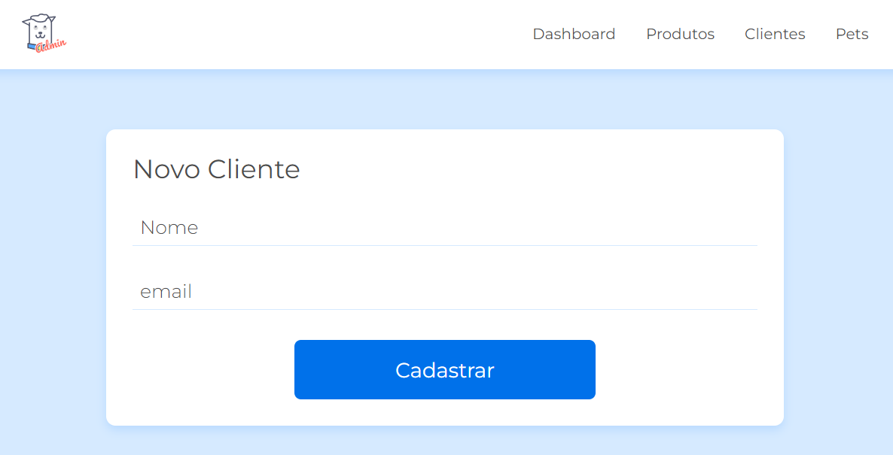
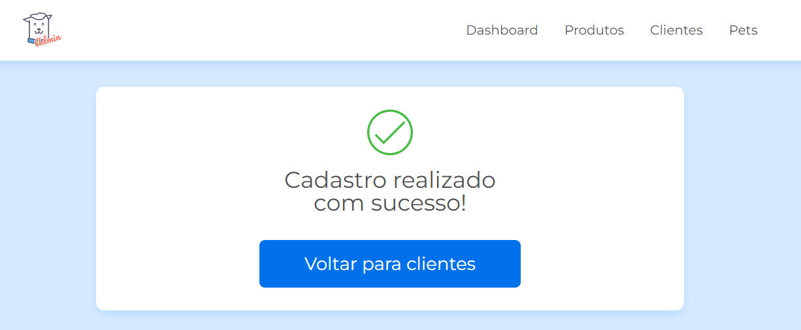
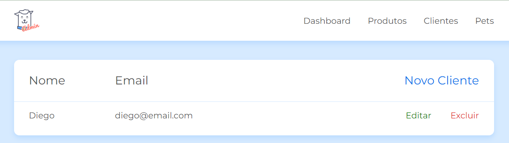

# CRUD com JavaScript

CRUD representa as quatro operações básicas utilizadas em sistemas de banco de dados: Create (Criar), Read (Ler), Update (Atualizar) e Delete (Apagar). 

Essas operações são essenciais para a manipulação de dados em qualquer aplicação, com JavaScript não é diferente 
e com esse projeto implementamos as operações de CRUD em um aplicação de cadastro de usuários.

## Interface do Projeto

  

## Sumário

- [Tecnologias Utilizadas](#tecnologias-utilizadas)
- [Status](#status)
- [Descrição](#descrição)
- [Funcionalidades](#funcionalidades)
- [Como Usar](#como-usar)
- [Autor](#autor)

## Tecnologias Utilizadas

  

    
  

  

    
  

  

    
  

## Status

## Descrição

Este projeto realiza requisições do Front-end diretamente no Back-end.

## Funcionalidades

Permite fazer requisições como adicionar, editar e excluir um usuário de uma API.

### Mensagem de Sucesso

  

### Após a adição do Cliente

#### Sendo possivel editar ou excluir o cliente

  

## Como Usar

1. Na pasta Admin:
   - `npm install -g json-server`
   - `npm install -g browser-sync`
2. Para rodar as instalações acima:
   - `json-server --watch db.json`
   - `browser-sync start --server --file . --host --port 5000 --startPath admin/telas/lista_cliente.html`
   - OBS: Usar um terminal para cada um

## Autor

Desenvolvido por Diego Franco.
